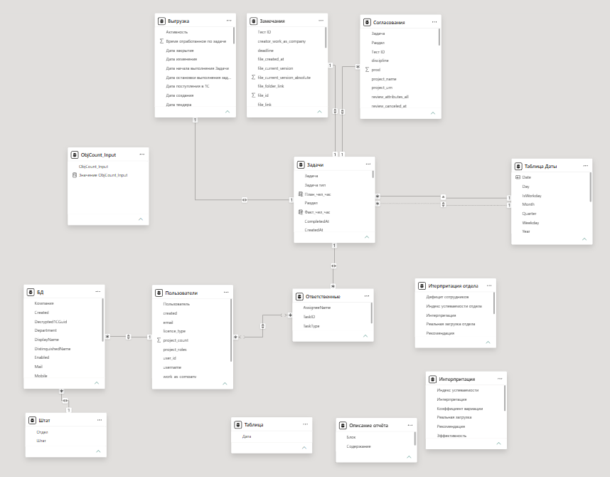
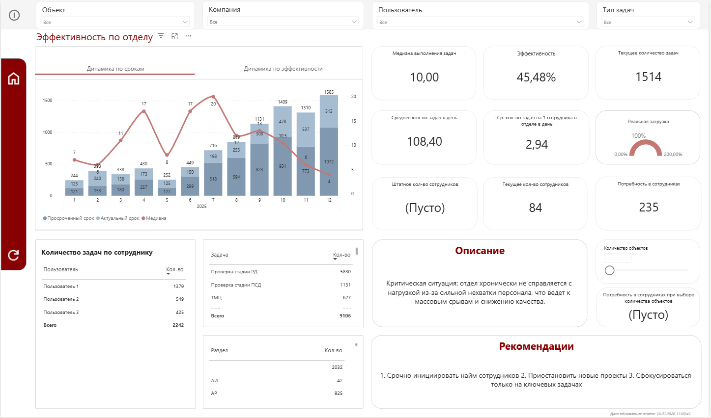

# BI Аналитика Workforce Management: Предиктивная система оценки эффективности сотрудников

## Обзор проекта

BI-система для анализа эффективности сотрудников, оценки нагрузки отделов и выявления узких мест в процессах выполнения задач.

Проект разработан как инструмент поддержки управленческих решений и позволяет руководителям объективно оценивать производительность подразделений на основе фактических данных по задачам.

Основная задача системы — показать реальную загрузку сотрудников, определить дефицит ресурсов и выявить факторы снижения эффективности.

---

## Бизнес-задача

До внедрения аналитической системы:

* отсутствовала централизованная аналитика по задачам;
* данные были распределены между несколькими системами;
* отсутствовала прозрачная оценка загрузки сотрудников;
* было невозможно объективно оценивать потребность в персонале;
* руководители не имели инструмента для выявления перегрузки и просрочек.

Ручной анализ большого объема задач занимал значительное время и не позволял оперативно принимать решения.

---

## Цель проекта

* Консолидировать данные о задачах из различных систем;
* Построить единую систему аналитики эффективности сотрудников;
* Выявлять перегрузку и дефицит ресурсов;
* Сократить медианное время выполнения задач;
* Повысить прозрачность процессов управления задачами;
* Предоставить руководителям инструмент для принятия решений.

---

## Используемые данные

Источники данных:

* Битрикс24;
* G-Station;
* тестируемая интеграция 1С.

Основные сущности:

* задачи;
* сотрудники;
* отделы;
* сроки выполнения;
* статусы задач;
* объекты;
* типы задач.

Объем данных пилота:

### Отдел 1

* 5609 оцифрованных задач;
* 2227 задач в период пилота.

### Отдел 2

* 5399 оцифрованных задач;
* 2824 задач в период пилота.

---

## Архитектура решения

### 1. Сбор и консолидация данных

* Сбор данных из нескольких систем;
* Унификация шаблонов задач;
* Подготовка данных для аналитики.

### 2. ETL и обработка данных

* Очистка данных;
* Нормализация структуры задач;
* Подготовка расчетных показателей;
* Формирование единой аналитической модели.

### 3. Аналитическая модель

* Расчет эффективности сотрудников;
* Анализ медианного времени выполнения;
* Анализ текущей и прогнозируемой нагрузки;
* Определение потребности в персонале.

### 4. Визуализация

* Power BI дашборды;
* Интерактивная фильтрация;
* Drill-down аналитика;
* KPI карточки;
* Анализ динамики эффективности.

---

## Модель данных (Data Modeling)

Тип модели: аналитическая (приближенная к Star Schema)

* Факты:

  * согласования
  * замечания
  * задачи

* Измерения:

  * пользователи
  * объекты
  * даты
  * разделы документации

Модель позволяет агрегировать данные и выполнять многомерный анализ.

### Фактовые таблицы

* задачи;
* выполнение задач;
* просроченные задачи.

### Измерения

* сотрудники;
* отделы;
* объекты;
* типы задач;
* календарь;
* статусы.

### Основные расчетные показатели

* медиана выполнения задач;
* эффективность сотрудников;
* текущая загрузка;
* просроченная нагрузка;
* потребность в персонале;
* среднее количество задач на сотрудника.

Модель позволяет анализировать производительность подразделений в различных аналитических разрезах.

---

## Ключевые BI-метрики

* Эффективность сотрудников;
* Медианное время выполнения задач;
* Количество задач в работе;
* Просроченные задачи;
* Нагрузка по сотрудникам;
* Нагрузка по отделам;
* Потребность в персонале;
* Среднее количество задач на сотрудника.

---

## Результаты пилота

### Отдел 1

* Медианное время выполнения задачи:

  * 14 дней → 12 дней;
  * снижение времени выполнения на 14,3%.

* Эффективность сотрудников:

  * 42,29% → 70,53%;
  * рост эффективности на 66,8%.

---

### Отдел 2

* Медианное время выполнения задачи:

  * 13 дней → 7 дней;
  * снижение времени выполнения на 46,2%.

* Эффективность сотрудников:

  * 34,77% → 86,96%;
  * рост эффективности на 150%+.

---

### Итоги пилота

Плановая метрика:

* рост производительности >10%.

Фактический результат:

* прирост производительности >20%.

Дополнительно:

* выявлены перегруженные сотрудники;
* определены узкие места процессов;
* рассчитана потребность в персонале;
* повышена прозрачность процессов выполнения задач.

---

## Инсайты (Business Insights)

* Выявлена неравномерная загрузка сотрудников;
* Обнаружены процессы с высоким количеством просрочек;
* Определены отделы с дефицитом ресурсов;
* Найдены задачи, создающие bottleneck в процессах;
* Подтверждена связь между перегрузкой и снижением эффективности.

Практическое применение:

* перераспределение нагрузки;
* планирование найма;
* оптимизация процессов;
* повышение эффективности подразделений.

---

## Функциональность дашборда

* KPI карточки;
* Анализ эффективности;
* Анализ сроков выполнения;
* Анализ нагрузки сотрудников;
* Drill-down аналитика;
* Фильтрация по отделам, объектам и сотрудникам;
* Анализ потребности в персонале;
* Мониторинг просроченных задач.

---

## Используемые технологии

* Power BI;
* DAX;
* Power Query;
* SQL;
* Bitrix24;
* G-Station;
* 1С (тестируемая интеграция).

---

Ключевые навыки:

`Power BI` `DAX` `SQL` `Power Query` `Data Modeling` `ETL` `Dashboard Development` `Business Intelligence` `KPI` `Workforce Analytics` `Data Visualization` `Performance Analytics` `BI Reporting`

---

## Скриншоты

### Дашборд эффективности сотрудников

---

## Вывод

Проект демонстрирует практическое применение BI-аналитики для управления эффективностью сотрудников и анализа бизнес-процессов.

Основная ценность решения — перевод операционной деятельности в измеримые показатели и поддержка управленческих решений на основе данных.
